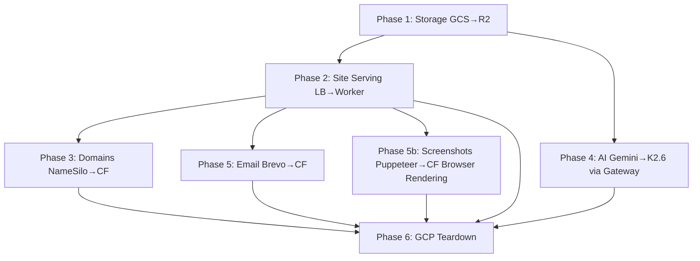

# GenWeb Migration Plan: GCP → Cloudflare (Keep Firebase)

## Context

GenWeb is an AI website builder currently running entirely on GCP. This plan migrates everything to Cloudflare **except Firebase Auth + Firestore**, based on our research that showed:
- CF R2 eliminates egress fees and the GCP Load Balancer (~$18/mo)
- CF automatic SSL eliminates ~300 lines of cert management code
- CF Registrar API sells domains at cost (saves ~$6.83/domain on .com)
- Kimi K2.6 on CF Workers AI matches or beats Gemini 2.5 Pro on coding benchmarks at 60% less output cost
- CF AI Gateway provides caching, fallback routing, and analytics for free

## What Migrates vs What Stays

```
MIGRATES TO CLOUDFLARE                    STAYS ON GCP / AS-IS
─────────────────────────                  ────────────────────
Site hosting (GCS → R2)                    Firebase Auth
Site serving (GCP LB → CF Workers)         Firebase Firestore
SSL certs (Cert Manager → CF auto)         Razorpay (payments)
DNS (NameSilo → CF Registrar/DNS)          Tailwind build (child_process)
Domain registration (NameSilo → CF)        Google Custom Search API
Screenshots (Puppeteer → CF Browser Rendering)
AI code gen (Gemini → Kimi K2.6 via GW)
AI architect (Gemini Flash → via GW)
Email (Brevo SMTP → CF Email Workers)
Project storage (GCS → R2)
Preview images (GCS → R2)
Analytics pageview tracking (via Worker)
```

## Architecture: Before & After

```
BEFORE (Current)
────────────────
                                    ┌─────────────────────┐
User ──► GCP Load Balancer ────────►│ Cloud Run (Express)  │
         │                          │  ├─ AI (Vertex AI)   │
         ├─ SSL (Cert Manager)      │  ├─ Builder          │
         ├─ URL Map routing         │  ├─ Puppeteer        │
         └─ Backend Buckets ──► GCS │  ├─ Storage (GCS)    │
                                    │  ├─ Domains(NameSilo)│
                                    │  └─ Email (Brevo)    │
                                    └─────────────────────┘

AFTER (Migrated)
────────────────
                     CLOUDFLARE EDGE
         ┌──────────────────────────────────────┐
         │                                      │
User ──► │  CF Worker (site-router)             │
         │  ├─ Custom domain routing            │
         │  ├─ SSL (automatic, free)            │
         │  ├─ CDN (300+ PoPs)                  │
         │  ├─ Analytics (pageview counting)    │
         │  └─ Serves from R2 ◄─── CF R2       │
         │         (site files + previews +     │
         │          project source)             │
         │                                      │
         │  CF AI Gateway                       │
         │  ├─ Primary: Kimi K2.6 (Workers AI)  │
         │  ├─ Fallback: Gemini (Vertex AI)     │
         │  └─ Caching + analytics              │
         │                                      │
         │  CF DNS + Registrar                  │
         │  ├─ Domain purchase (at-cost)        │
         │  └─ DNS (auto-managed)               │
         │                                      │
         │  CF Email Workers                    │
         │  └─ Transactional emails             │
         │                                      │
         │  CF Browser Rendering                │
         │  └─ Screenshot thumbnails (no more   │
         │     Puppeteer on Cloud Run)          │
         └──────────────────┬───────────────────┘
                            │ API requests only
                            ▼
         ┌──────────────────────────────────────┐
         │  GCP Cloud Run (Express API)         │
         │  ├─ /api/* routes (54 endpoints)     │
         │  ├─ Builder (Tailwind only)           │
         │  ├─ Firebase Auth verification       │
         │  ├─ Firebase Firestore (DB)          │
         │  └─ Razorpay (payments)              │
         └──────────────────────────────────────┘
```

## Migration Phases

---

### Phase 1: Storage — GCS → R2
**Risk: Low | Impact: High | Effort: ~2 days**

Migrate all file storage from Google Cloud Storage to Cloudflare R2. R2 is S3-compatible, so we use the `@aws-sdk/client-s3` package.

**Files to modify:**
- `services/storage.js` — Replace `@google-cloud/storage` with `@aws-sdk/client-s3`
- `services/deploy.js` — Replace GCS bucket creation with R2 bucket operations
- `server.js:403-447` (`saveBuildArtifacts`) — Update upload calls to use R2
- `server.js:276-314` (`ensureProjectSource`) — Update download calls to use R2
- `package.json` — Add `@aws-sdk/client-s3`, remove `@google-cloud/storage`

**Key changes in `services/storage.js`:**
```
BEFORE: const { Storage } = require('@google-cloud/storage')
AFTER:  const { S3Client, PutObjectCommand, GetObjectCommand, 
               ListObjectsV2Command, DeleteObjectsCommand } = require('@aws-sdk/client-s3')

BEFORE: storage.bucket(bucketName).upload(filePath, opts)
AFTER:  s3.send(new PutObjectCommand({ Bucket, Key, Body, ContentType, CacheControl }))

BEFORE: https://storage.googleapis.com/{bucket}/{path}
AFTER:  https://{R2_PUBLIC_DOMAIN}/{bucket}/{path}
```

**R2 buckets to create:**
- `genweb-projects` — replaces `sgp1-projects-storage` (project source files)
- `genweb-sites` — replaces per-project `site-{id}` buckets (deployed site files)
- `genweb-hosting` — replaces `sgp1-sites-hosting` (preview images)

**Verification:**
- Build a test site → confirm files upload to R2
- Download project source → confirm `ensureProjectSource` works from R2
- Preview images accessible at R2 public URL

---

### Phase 2: Site Serving — GCP LB → CF Worker
**Risk: Medium | Impact: High | Effort: ~3 days**

Replace the Express wildcard domain routing (`server.js:168-270`) and the entire GCP Load Balancer infrastructure with a Cloudflare Worker that serves sites from R2.

**New file: `cf-worker/site-router.js`** (Cloudflare Worker)
```
Purpose: Handle all incoming requests to *.genweb.in and custom domains
- Look up domain/subdomain → projectId (via Firebase REST API or cached KV)
- Serve static files from R2 bucket genweb-sites/{projectId}/
- Track pageviews (write to CF Analytics Engine or forward to Express API)
- Return 404 for unknown domains
```

**Files to delete/simplify:**
- `services/domains.js` — Remove ALL GCP functions (~400 lines):
  - `ensureBackendBucket()` — no longer needed (no backend buckets)
  - `updateUrlMap()` — no longer needed (no URL map)
  - `ensureCertificateManagerCert()` — no longer needed (CF auto-SSL)
  - `addCertificateToMap()` — no longer needed (no cert maps)
  - `cleanupGCPDomain()` — replace with CF domain cleanup
  - `setupGCPDomain()` — replace with CF domain setup (just add to CF zone)
- `server.js:168-270` — Remove wildcard domain routing middleware (Worker handles this)

**Files to modify:**
- `services/deploy.js` — `deploySite()` now uploads to R2 `genweb-sites/{projectId}/` (already done in Phase 1), no GCS bucket creation/public-access/website-config needed
- `server.js` — Remove GCP proxy logic (`https.get(gcsUrl, ...)` at line 223)

**Dependencies to remove from `package.json`:**
- `@google-cloud/compute` (BackendBucketsClient, UrlMapsClient)
- `@google-cloud/certificate-manager`

**CF setup required:**
- Create CF Worker `site-router` with R2 binding
- Add `*.genweb.in` custom domain to Worker
- Configure Worker routes for custom domains

**Verification:**
- Visit `{subdomain}.genweb.in` → site loads from R2 via Worker
- Visit custom domain → site loads, SSL auto-provisions
- 404 page works for unknown domains
- Pageview tracking functions correctly

---

### Phase 3: Domain Registration — NameSilo → CF Registrar
**Risk: Low | Impact: Medium | Effort: ~2 days**

Replace NameSilo API calls with Cloudflare Registrar API for domain search, availability check, and purchase. Keep NameSilo as fallback for `.in` domains (CF may not support).

**Files to modify:**
- `services/domains.js` — Rewrite domain functions:
  - `checkAvailability()` → CF Registrar API `POST /registrar/domains/search`
  - `getSuggestions()` → CF Registrar API search endpoint
  - `purchaseDomain()` → CF Registrar API `POST /registrar/domains/register`
  - `addDNSRecord()` → CF DNS API (or automatic if domain is on CF)
  - `listDNSRecords()` → CF DNS API
  - `addDNSRecordGeneric()` → CF DNS API
  - `deleteDNSRecord()` → CF DNS API
  - `changeNameServers()` → Remove (CF manages NS automatically)
  - `verifyDomainDNS()` → CF DNS API or keep dns.resolve4 check

**New domain setup flow:**
```
BEFORE (8 steps, ~400 lines):
  NameSilo register → Add A record → Add CNAME
  → GCP create backend bucket → Update URL map
  → Create certificate → Add cert map entry → Verify DNS

AFTER (2 steps, ~30 lines):
  CF register domain → Add custom domain to site-router Worker
  (DNS, SSL, CDN all automatic)
```

**NameSilo fallback for .in domains:**
- Keep `callNameSilo()` and NameSilo-specific functions behind a conditional
- Route: if TLD is `.in` or unsupported by CF → use NameSilo + manual DNS setup
- Route: all other TLDs → use CF Registrar

**Env vars to add:**
- `CF_API_TOKEN` — Cloudflare API token
- `CF_ACCOUNT_ID` — Cloudflare account ID

**Env vars to remove (eventually):**
- `GCP_LB_IP` — no more load balancer
- `GCP_PROJECT` usage for compute/cert-manager (keep for Firebase)

**Verification:**
- Search for a `.com` domain → results appear from CF API
- Purchase a test domain → domain registered, auto-added to CF
- Custom domain connects to site → SSL works within minutes (not 5-10 min)
- `.in` domain fallback still works via NameSilo

---

### Phase 4: AI — Gemini → Kimi K2.6 via CF AI Gateway
**Risk: Medium | Impact: High (cost) | Effort: ~3 days**

Migrate AI inference from Vertex AI to Cloudflare AI Gateway with Kimi K2.6 as primary and Gemini as fallback.

**Phase 4a: Set up AI Gateway with Gemini pass-through (Day 1)**

Zero-risk first step — route existing Gemini calls through CF AI Gateway to get caching and analytics before switching models.

**Files to modify:**
- `services/ai-coder.js` — Replace Vertex AI SDK with HTTP calls through AI Gateway
  - `BEFORE: vertex_ai.preview.getGenerativeModel({ model: 'gemini-2.5-pro' })`
  - `AFTER: fetch('https://gateway.ai.cloudflare.com/v1/{account}/genweb/google-vertex-ai/...', { model: 'gemini-2.5-pro' })`
- `services/ai-architect.js` — Same pattern (currently uses `gemini-3.1-flash-lite-preview`)
- `services/business-extractor.js` — Same pattern (uses Vertex AI + Google Custom Search)

**Phase 4b: Add Kimi K2.6 as primary model (Day 2-3)**

- Configure AI Gateway with fallback chain: Kimi K2.6 → Gemini 2.5 Pro
- Re-tune prompts in `ai-coder.js` for Kimi K2.6 behavior:
  - Test the `BASE_PROMPT_START` constraints (no style blocks, theme colors, etc.)
  - Adjust temperature/topP if needed
  - Validate 16K output token generation quality
- Re-tune `ai-architect.js` JSON output (ensure structured output works)
- A/B test: route 10% traffic to K2.6, compare output quality

**Cost impact:**
```
Per build (5 pages):  Gemini: $0.63  →  Kimi K2.6: $0.26  (59% savings)
100 builds/month:     $63/mo         →  $26/mo
500 builds/month:     $315/mo        →  $130/mo
```

**Dependencies to remove from `package.json`:**
- `@google-cloud/vertexai` (replace with HTTP fetch calls through AI Gateway)

**Keep:**
- `googleapis` — still needed for Google Custom Search in `business-extractor.js`

**Verification:**
- Generate a site with Kimi K2.6 → compare HTML quality against Gemini output
- Test all page types (Home, About, Contact, Services, Blog)
- Verify JSON design system output from architect
- Confirm AI Gateway dashboard shows requests, cache hits, costs
- Confirm fallback triggers when K2.6 is unavailable

---

### Phase 5: Email — Brevo → CF Email Workers
**Risk: Low | Impact: Low | Effort: ~1 day**

Replace Brevo SMTP with Cloudflare Email Workers for transactional emails.

**Files to modify:**
- `server.js` — Replace `nodemailer` transporter with CF Email Worker API calls
  - Lines 391-399: Remove nodemailer transport config
  - Lines 575-591: Build notification email → call CF Email Worker
  - Lines 1528-1591: Build completion email → call CF Email Worker  
  - Lines 2530-2561: Other transactional emails → call CF Email Worker
- `package.json` — Remove `nodemailer`

**New file: `cf-worker/email-worker.js`** (or add to existing Worker)
- Receives email send requests from Express API
- Sends via CF Email Routing

**Env vars to remove:**
- `BREVO_SMTP_HOST`, `BREVO_SMTP_PORT`, `BREVO_SMTP_USER`, `BREVO_SMTP_KEY`, `BREVO_SMTP_FROM`

**Verification:**
- Trigger a build → user receives notification email
- Check email deliverability (SPF/DKIM records on genweb.in)

---

### Phase 5b: Screenshots — Puppeteer → CF Browser Rendering
**Risk: Low | Impact: Medium | Effort: ~1 day**

Replace local Puppeteer (which requires a full Chromium binary on Cloud Run) with Cloudflare Browser Rendering API — a single HTTP call, no dependencies.

**Current flow:**
- `services/screenshot.js` — launches Puppeteer, opens local `index.html`, takes 1280x800 JPEG screenshot
- Called from `server.js:417-419` (after build) and `server.js:1012-1027` (manual re-screenshot endpoint)
- Requires `puppeteer` package (~400MB Chromium download)

**New flow:**
- After deploying site files to R2, call CF Browser Rendering API with the live site URL
- CF renders the page on its edge infrastructure and returns a screenshot
- No Chromium binary needed on Cloud Run → smaller Docker image, faster cold starts

**Files to modify:**
- `services/screenshot.js` — Replace entire file (~43 lines) with CF Browser Rendering API call:
  ```
  BEFORE: puppeteer.launch() → page.goto(localFile) → page.screenshot()
  AFTER:  fetch('https://api.cloudflare.com/client/v4/accounts/{CF_ACCOUNT_ID}/browser-rendering/screenshot', {
            method: 'POST',
            headers: { 'Authorization': 'Bearer {CF_API_TOKEN}' },
            body: JSON.stringify({ url: siteUrl, viewport: { width: 1280, height: 800 }, format: 'jpeg', quality: 80 })
          })
  ```
- `server.js:414-419` — Change `captureScreenshot(localPath)` → `captureScreenshot(liveSiteUrl)` (call after deploy, not before)
- `server.js:1012-1027` — Same: use live URL instead of local file path
- `services/builder.js:8` — Remove `require('./screenshot')` if only re-exported
- `package.json` — Remove `puppeteer` (saves ~400MB in Docker image)
- `Dockerfile` — Remove any Chromium/Puppeteer-related apt-get installs

**Env vars:**
- Reuses `CF_API_TOKEN` and `CF_ACCOUNT_ID` (already added in Phase 3)

**Benefits:**
- Removes ~400MB Chromium binary from Docker image
- Faster Cloud Run cold starts
- No `--no-sandbox` security flags needed
- Included in CF Workers Paid plan (no extra cost)

**Verification:**
- Build a site → preview thumbnail generated via CF Browser Rendering
- Manual re-screenshot endpoint works
- Thumbnail quality matches current Puppeteer output
- Docker image size reduced significantly

---

### Phase 6: Cleanup & GCP Teardown
**Risk: Low | Impact: Medium | Effort: ~1 day**

Remove all unused GCP infrastructure and code.

**GCP resources to delete:**
- Load Balancer (`genweb-lb`)
- All Backend Buckets (`backend-site-*`)
- Certificate Map (`genweb-cert-map`) + all cert map entries
- All managed certificates (`cert-*`)
- GCS site buckets (`site-*`) — after confirming R2 has all data
- GCS storage buckets (`sgp1-projects-storage`, `sgp1-sites-hosting`) — after R2 migration
- Static IP (`34.50.155.64`) — release after DNS propagation

**Code cleanup:**
- Remove unused GCP SDK imports from `domains.js`
- Remove `@google-cloud/compute`, `@google-cloud/certificate-manager`, `@google-cloud/storage`, `puppeteer` from `package.json`
- Remove GCP-specific env vars from `env.yaml`
- Simplify Dockerfile (remove any GCP-specific setup if present)

**Verification:**
- Full end-to-end test: register domain → build site → deploy → visit custom domain → SSL works
- Monitor costs for 1 week to confirm savings

---

## Migration Order & Dependencies



- **P1 must be first** — P2 depends on R2 being ready
- **P4 is independent** — can run in parallel with P2/P3
- **P5 and P5b are independent** — can run anytime after P2 (sites must be live on R2 for screenshot URLs)
- **P6 must be last** — only after everything else is verified

## Estimated Timeline

| Phase | Effort | Can Parallelize With |
|---|---|---|
| Phase 1: Storage | 2 days | — |
| Phase 2: Site Serving | 3 days | Phase 4 |
| Phase 3: Domains | 2 days | Phase 4, 5 |
| Phase 4: AI Gateway | 3 days | Phase 2, 3 |
| Phase 5: Email | 1 day | Phase 3, 4, 5b |
| Phase 5b: Screenshots | 1 day | Phase 3, 4, 5 |
| Phase 6: Cleanup | 1 day | — |
| **Total (sequential)** | **13 days** | |
| **Total (with parallelism)** | **~8 days** | |

## Estimated Monthly Cost Savings

| Item | Current (GCP) | After (CF) | Savings |
|---|---|---|---|
| Load Balancer | ~$18/mo | $0 | $18 |
| GCS egress (site serving) | ~$5-20/mo | $0 (R2 zero egress) | $5-20 |
| GCS storage | ~$2-5/mo | ~$1-2/mo (R2) | $1-3 |
| SSL certificates | free but complex | free and automatic | Engineering time |
| AI (100 builds) | ~$63/mo | ~$26/mo | $37 |
| AI (500 builds) | ~$315/mo | ~$130/mo | $185 |
| Domains (50/yr) | ~$865/yr | ~$523/yr | $342/yr ($28/mo) |
| Brevo SMTP | free tier | free tier | $0 |
| CF Workers Paid plan | — | +$5/mo | -$5 |
| **Total (100 builds)** | **~$95/mo** | **~$34/mo** | **~$61/mo (64%)** |
| **Total (500 builds)** | **~$350/mo** | **~$163/mo** | **~$187/mo (53%)** |

## Risk Mitigations

| Risk | Mitigation |
|---|---|
| Kimi K2.6 output quality lower than Gemini | AI Gateway fallback to Gemini; A/B test before full switch |
| CF Registrar API is beta (no renewals) | Keep NameSilo credentials active; manual renewal fallback |
| R2 eventual consistency delays | Add 2-3s delay after deploy before marking site as live |
| CF Workers AI billing bugs (like Gemma 37x) | Set spending alerts; monitor daily; keep Vertex AI as escape hatch |
| .in domains not on CF Registrar | NameSilo fallback for .in TLD, CF for everything else |
| CF Email deliverability issues | Keep Brevo credentials as fallback; test SPF/DKIM first |
| Data migration (existing GCS → R2) | Write one-time migration script; run in parallel, verify, then cutover |

## Pre-Migration Checklist

1. [ ] Create Cloudflare account and Workers Paid plan ($5/mo)
2. [ ] Create R2 buckets (genweb-projects, genweb-sites, genweb-hosting)
3. [ ] Set up AI Gateway named "genweb"
4. [ ] Transfer genweb.in DNS to Cloudflare (change NS at current registrar)
5. [ ] Generate CF API token with required permissions
6. [ ] **Rotate all secrets exposed in `env.yaml`** (critical security issue found during analysis)
